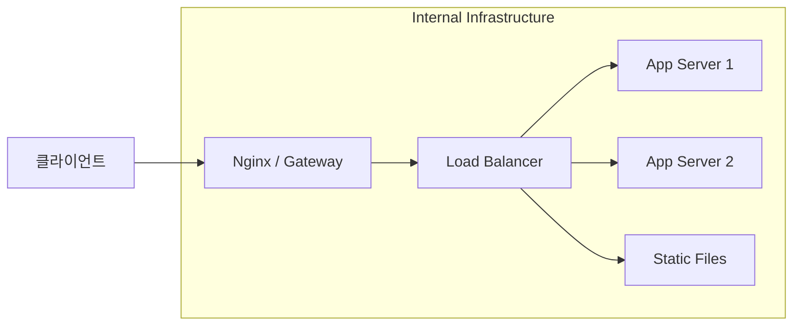

# 5교시. nginx 설정 + Reverse Proxy
> 백엔드 개발자를 위한 리눅스 실무 | 50분 | 이론 20분 + 실습 30분

---

## 0. [사전 개념] 백엔드를 위한 인프라 용어 정리

본격적인 실습 전, 백엔드 개발자로서 협업 시 반드시 마주하게 될 핵심 용어 4가지를 정리합니다.

### 1) Proxy (프록시) — "중개인"
프록시는 클라이언트와 서버 사이에서 **대리인** 역할을 수행합니다.
*   **Forward Proxy**: 내 컴퓨터(클라이언트)를 대신해서 웹에 접속해 주는 것.
*   **Reverse Proxy (Nginx의 핵심 역할)**: 외부 요청을 대신 받아서 내부의 백엔드 앱으로 전달해 주는 것.
    *   *효과*: 백엔드 앱의 실제 주소와 포트를 숨길 수 있어 **보안**이 강화됩니다.

### 2) Routing (라우팅) — "길 찾기"
들어온 요청의 URL이나 경로(`Path`)에 따라 **어느 서버로 보낼지 결정**하는 규칙입니다.
*   예: `/api`로 시작하면 8080포트 앱으로, `/images`로 시작하면 정적 파일 폴더로 보내는 설정.
*   Nginx에서는 `location` 블록을 통해 이 규칙을 정의합니다.

### 3) Gateway (게이트웨이) — "정문"
서로 다른 네트워크 간의 **출입구** 역할을 합니다. 
*   단순히 길을 안내하는 것뿐만 아니라, **인증/인가, 트래픽 제한(Rate Limiting)** 등 입구에서 해야 할 복잡한 일들을 수행합니다.
*   Nginx는 강력한 기능을 바탕으로 **API Gateway** 역할도 함께 수행할 때가 많습니다.

### 4) Load Balancer (로드밸런서) — "교통 정리"
한 대의 서버에 트래픽이 몰리지 않도록 **여러 대의 백엔드 서버에 골고루 분산**시켜 주는 장치입니다.
*   Nginx에서는 `upstream` 설정을 통해 여러 대의 앱 서버 주소를 묶어 관리합니다.



---

## 실습 환경

```bash
# 포트 포워딩 포함한 컨테이너 실행
docker run -it --name nginx-lab -p 80:80 -p 443:443 -p 8080:8080 ubuntu:22.04 /bin/bash
sed -i 's/archive.ubuntu.com/ftp.kaist.ac.kr/g' /etc/apt/sources.list


# 필수 패키지 설치
apt update && apt install -y nginx curl vim python3
```

---

1. nginx 설정 파일 구조를 이해하고 직접 수정할 수 있다.
2. 백엔드 앱 앞에 nginx reverse proxy를 구성할 수 있다.

---

## 모듈 05. nginx 기본 구조 (10분)

### 5-1. nginx 디렉토리 구조

```
/etc/nginx/
├── nginx.conf               ← 메인 설정 파일 (글로벌 설정)
├── sites-available/         ← 가상 호스트 설정 파일 보관 위치
│   └── default              ← 기본 사이트 설정
├── sites-enabled/           ← 실제 활성화된 설정 (심볼릭 링크)
│   └── default -> ../sites-available/default
├── conf.d/                  ← 추가 설정 파일
└── snippets/                ← 재사용 가능한 설정 조각
```

**활성화/비활성화 방법**

```bash
# 설정 파일 활성화 (심볼릭 링크 생성)
ln -s /etc/nginx/sites-available/myapp /etc/nginx/sites-enabled/

# 비활성화 (링크 삭제)
rm /etc/nginx/sites-enabled/myapp

# 설정 문법 검사
nginx -t

# 설정 반영 (서비스 중단 없이)
systemctl reload nginx
# 또는 Docker 환경에서
service nginx reload
```

---

### 5-2. nginx.conf 기본 구조

```nginx
# /etc/nginx/nginx.conf

user www-data;
worker_processes auto;          # CPU 코어 수에 맞게 자동 설정

events {
    worker_connections 1024;    # 워커 1개당 최대 연결 수
}

http {
    # MIME 타입 정의
    include /etc/nginx/mime.types;

    # 로그 설정
    access_log /var/log/nginx/access.log;
    error_log  /var/log/nginx/error.log;

    # Gzip 압축
    gzip on;

    # 개별 서버 설정 포함
    include /etc/nginx/sites-enabled/*;
}
```

---

## 모듈 06. Reverse Proxy 설정 (10분)

### 6-1. Reverse Proxy란

```
클라이언트 → nginx (80/443) → 백엔드 앱 (8080)
```

- 백엔드 앱의 포트를 외부에 직접 노출하지 않음
- 하나의 서버에서 여러 앱을 도메인/경로로 분리
- 정적 파일은 nginx가 직접 서빙

---

### 6-2. 기본 Reverse Proxy 설정

```nginx
# /etc/nginx/sites-available/myapp

server {
    listen 80;
    server_name myapp.example.com;   # 도메인 (없으면 _ 사용)

    location / {
        proxy_pass http://localhost:8080;   # 백엔드 앱 주소

        # 실제 클라이언트 정보를 앱에 전달
        proxy_set_header Host $host;
        proxy_set_header X-Real-IP $remote_addr;
        proxy_set_header X-Forwarded-For $proxy_add_x_forwarded_for;
        proxy_set_header X-Forwarded-Proto $scheme;
    }
}
```

---

### 6-3. 경로별 라우팅

```nginx
server {
    listen 80;
    server_name _;

    # API 요청 → 백엔드 앱
    location /api/ {
        proxy_pass http://localhost:8080;
        proxy_set_header Host $host;
        proxy_set_header X-Real-IP $remote_addr;
    }

    # 정적 파일 → nginx 직접 서빙
    location /static/ {
        root /var/www/myapp;
        expires 30d;
    }

    # 프론트엔드 → 별도 앱
    location / {
        proxy_pass http://localhost:3000;
        proxy_set_header Host $host;
    }
}
```

---

### 6-4. upstream — 로드밸런싱

```nginx
upstream backend {
    server localhost:8081;
    server localhost:8082;
    server localhost:8083;
    # 기본값: round-robin (순서대로 분배)
}

server {
    listen 80;

    location /api/ {
        proxy_pass http://backend;
        proxy_set_header Host $host;
        proxy_set_header X-Real-IP $remote_addr;
    }
}
```

---

---

## 실습 과제 (30분)

### Step 1. nginx 설치 및 시작

```bash
service nginx start
service nginx status

# 기본 페이지 확인
curl http://localhost
```

### Step 2. 백엔드 앱 실행

```bash
# 테스트용 Python 앱
python3 -m http.server 8080 > /tmp/server_8080.log 2>&1 &

# 동작 확인
curl http://localhost:8080
```

### Step 3. Reverse Proxy 설정

```bash
# 기존 default 설정 비활성화
rm /etc/nginx/sites-enabled/default

# 새 설정 파일 작성
cat > /etc/nginx/sites-available/myapp << 'EOF'
server {
    listen 80;
    server_name _;

    location /api/ {
        proxy_pass http://localhost:8080/;
        proxy_set_header Host $host;
        proxy_set_header X-Real-IP $remote_addr;
        proxy_set_header X-Forwarded-For $proxy_add_x_forwarded_for;
    }

    location / {
        root /var/www/html;
        index index.html;
    }
}
EOF

# 활성화
ln -s /etc/nginx/sites-available/myapp /etc/nginx/sites-enabled/

# 문법 검사
nginx -t

# 설정 적용
service nginx reload
```

### Step 4. Reverse Proxy 동작 확인

```bash
# nginx를 통해 백엔드 앱 접근
curl http://localhost/api/

# nginx 직접 접근 (정적 파일)
curl http://localhost/
```

### Step 6. 로그 확인

```bash
# 접근 로그
tail -f /var/log/nginx/access.log

# 에러 로그
tail -f /var/log/nginx/error.log
```

---

## 핵심 정리

| 항목 | 내용 |
|------|------|
| 설정 파일 위치 | `/etc/nginx/sites-available/` |
| 활성화 방법 | `ln -s sites-available/파일 sites-enabled/` |
| 문법 검사 | `nginx -t` |
| 설정 반영 | `service nginx reload` |
| Reverse Proxy 핵심 | `proxy_pass http://localhost:8080` |
| 클라이언트 IP 전달 | `proxy_set_header X-Real-IP $remote_addr` |